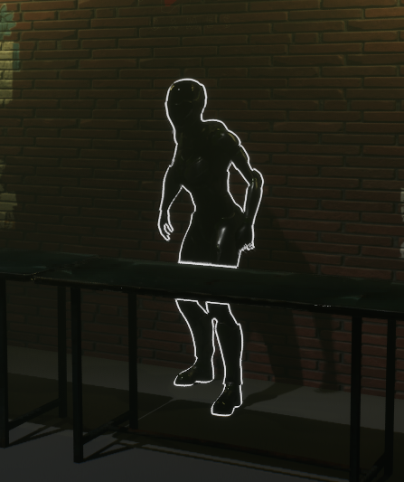
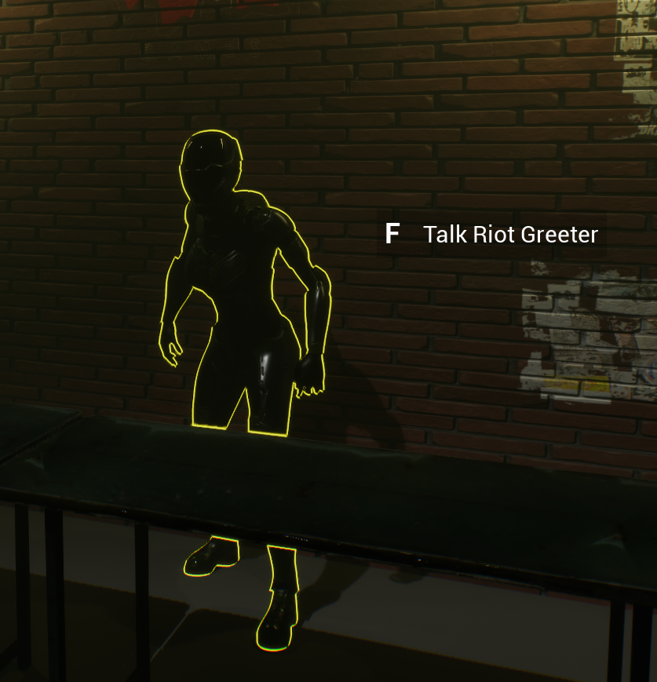
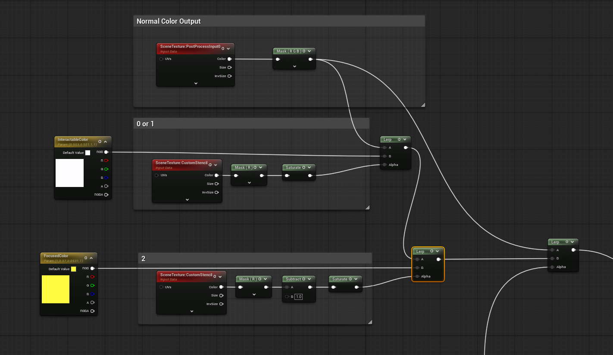
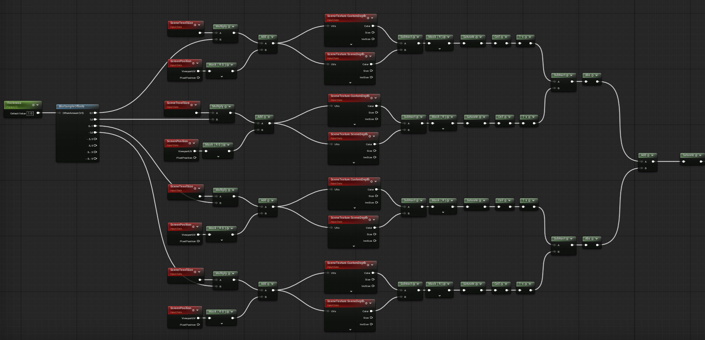

# Latest Updates

This document tracks recent project updates in one place.

## Table of Contents

- [Highlighted Interactables](#highlighted-interactables)

## Highlighted Interactables

- Added shared custom depth stencil values in `Source/RiotStory/Rendering/RiotStoryRenderStencil.h`.
- Current values:
  - `None = 0`
  - `InteractableHighlight = 1`
  - `InteractableFocused = 2`

I wanted to add a simple outline to the interactable items/characters in the game.  I chose custom stencil to avoid multiple materials having to be added through overlay materials as this grows.

I also chose to specifically do the outline based on the custom depth render pass as well because using scene depth made the outline too light at distance and having outlines based off of normals was way too noisy because of the detailing of some of the characters.  The custom render depth gives a nice clean silhouette outline.

### Downside
If interactables are overlapping then they will no longer have distinct outlines.  We can fix this by adding in some additional checks on the depth pass, but for the minimal amount of interactables currently it really didn't make sense to add those additional instructions.

### New Gameplay Images and Blueprint graphs

This is probably better done in HLSL because of the many repeated nodes, but for a first pass this should be ok.

