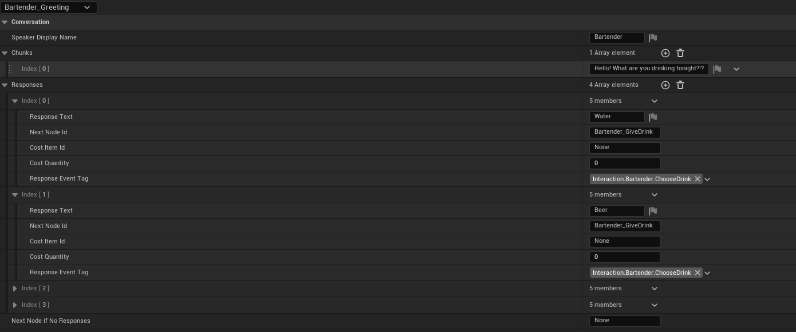
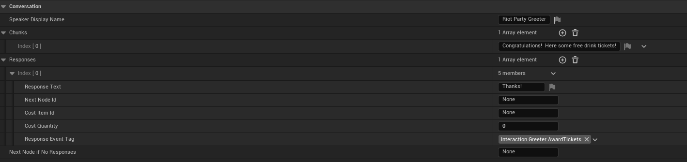
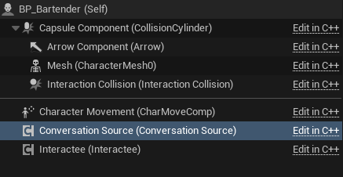
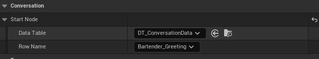
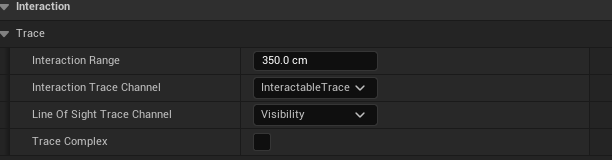
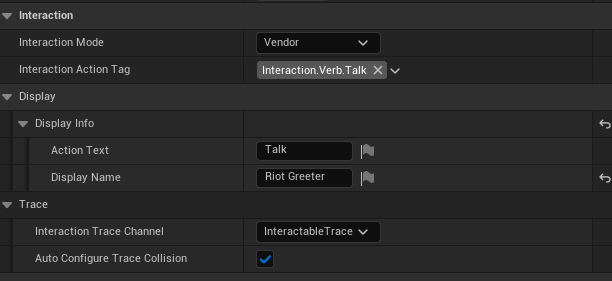
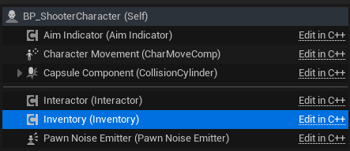

# RiotStory

> **Warning:** This is not a buildable project (asset files are too large for personal GitHub). Assets can be provided upon request.

The goal of this project was to make a little game jam to highlight the moment when I first discovered Riot Games while providing some additional code examples from intentionally built from scratch systems.
For context, The scene takes place in San Francisco at a Riot After Party during GDC 2010.

The game is a simple 'business card' throwing game.  Trying to get points by landing your cards into the bowls.
It also contains a few extra side mechanics that show the built systems at work.

This document will cover multiple systems and how to use them.  As well as my thoughts for future improvements.

## Gameplay Videos
https://youtu.be/KdOu6tCFDEg

## Table of Contents

- [Conversation System](#conversation-system)
- [Interaction System](#interaction-system)
- [Inventory System](#inventory-system)
- [Task Setup](#task-setup)
- [Potential Next Steps: Logs and Analytics](#next-steps-logs-analytics-and-more)

---

## Conversation System

### Overview

The conversation system was built for NPC interactions.  It controls conversation flow and responses which is driven strictly from data.

- starts from a `FDataTableRowHandle` entry point
- displays text in chunks
- optionally offers response choices
- supports branching to new nodes
- can charge inventory costs for specific responses
- broadcasts state/ended/response events through `UGameplayMessageSubsystem`

Key classes:
- `UConversationRuntimeComponent`
- `UConversationSourceComponent`
- `UConversationUIBridgeComponent`
- `UConversationUI` (Blueprint widget contract)

Core message tags:
- `Message.Conversation.StartRequest`
- `Message.Conversation.StateChanged`
- `Message.Conversation.Ended`
- `Message.Conversation.ResponseEvent`

### How To Use

#### 1) Author Conversation Data

Create a Data Table using row struct `FConversationNodeRow` with:
- `SpeakerDisplayName`
- `Chunks` (array of dialogue text chunks shown one at a time) **Useful for breaking up large segments of text
- `Responses` (array of `FConversationResponseEntry`)
- `NextNodeIfNoResponses` (fallback branch when no explicit responses)

Each response (`FConversationResponseEntry`) supports:
- `ResponseText`
- `NextNodeId`
- `CostItemId` and `CostQuantity` (optional inventory cost)
- `ResponseEventTag` (for downstream gameplay hooks)

Blueprint Data Setup:

#### 2) Configure an NPC/Interactable as a Conversation Source

On the player actor or controller (I prefer it in the controller as UI will drive a lot of future triggers):
- add `ConversationRuntimeComponent`
- use SelectConversationResponse(ResponseIndex) to select a specific response
- use AdvanceConversation() to continue to the next conversation text chunk/node

On the interactable actor (example: vendor/NPC):
- add `UInteracteeComponent`
- set `InteractionActionTag` to `Interaction.Verb.Talk`
- add `UConversationSourceComponent`
- set `ConversationSource.StartNode` to the Data Table + row name

Without a valid `StartNode`, talk interactions will not start.

Blueprint Component Setup:

#### 3) UI Bridge Component for easy access

A UI bridge component was made to easily interface with UI elements
- `Conversation UI Bridge` (`UConversationUIBridgeComponent`)

The bridge listens for conversation messages and forwards only messages for the owning pawn.

See `ARiotStoryPlayerController` for a good example.

#### 4) Bind Conversation UI

`UConversationUI` exposes Blueprint events:
- `BP_ShowConversation`
- `BP_UpdateConversationText`
- `BP_ShowResponses`
- `BP_ClearOutResponses`

And callable notify functions These will be used in the UI to respond internally to click/select events:
- `NotifyResponseIndexChosen(int32 ResponseIndex)`
- `NotifyConversationWindowClicked()`

`ARiotStoryPlayerController` binds these to:
- `SelectConversationResponse(...)`
- `AdvanceConversation()`

Blueprint Example:

#### 5) Runtime Behavior Summary

- Interact on a talk-enabled interactee broadcasts `StartRequest`.
- Runtime validates handle and loads first node.
- Advancing walks through `Chunks`.
- If responses exist, runtime enters response selection state.
- Selecting a response may spend inventory cost and branch.
- Conversation ends with reason: `Completed`, `Cancelled`, `Replaced`, `InvalidData`, or `FailedToStart`.

### Future Thoughts

This was meant to be a quick and easy to setup conversation system, but there are some areas where it is lacking.
- It currently has no way to validate conversations paths based off of conditions.
- Responses could use a failed action or other "actions" to trigger when chosen
- It currently validates only inventory items which could be made to validate based off of an action or command
- Currently updating StartNodes manually to trigger changes which will definitely want to be more flexible

---

## Interaction System

### Overview

The interaction system is trace-driven and component-first:
- `UInteractorComponent` (usually on player pawn) performs forward multi-trace each tick
- resolves best valid target interactee
- validates line-of-sight
- manages highlight enter/exit
- executes interactions through `UInteracteeComponent`

`UInteracteeComponent` can run in modes:
- `Loot`
- `Vendor`
- `Custom`

It also supports actor-provided collision/highlight behavior via `IInteractionProviderInterface`.

### How To Use

#### 1) Add Interactor to Player Pawn

`ARiotStoryCharacter` already includes `UInteractorComponent` and binds interact input and calls `TryInteract`
This could be handled in a Controller or other pawn as needed.

Important interactor settings:
- `InteractionRange`
- `InteractionTraceChannel` (default `ECC_GameTraceChannel2`)
- `LineOfSightTraceChannel` (default `ECC_Visibility`)

Blueprint settings example:

#### 2) Configure Interactable Actors

Add `UInteracteeComponent` to target actor and set:
- `InteractionMode`
- `DisplayInfo.ActionText` and `DisplayInfo.DisplayName`
- optional item/cost fields depending on mode

Provide valid collision either by:
- implementing `IInteractionProviderInterface::GetInteractionCollisionComponent`, or
- setting `ExplicitInteractionCollision`, or
- allowing auto-resolution to first valid primitive component

Blueprint settings example:

#### 3) Wire Interaction UI

`UInteractorComponent` broadcasts `OnInteractableHighlightChanged`.

`ARiotStoryPlayerController` listens and updates `UInteractUI`:
- show prompt when a valid interactee is highlighted
- hide prompt when no target is valid

Display text format:
- `{ActionText} {DisplayName}`

Example class:
- `ARiotStoryPlayerController` (`OnInteractableHighlightChanged`) as the reference implementation for prompt show/hide and text updates.

#### 4) Interaction Execution Rules

On interact input:
- if a conversation is active, input advances/selects conversation
- otherwise `Interactor->TryInteract()` executes target interactee

Execution depends on `UInteracteeComponent::CanInteract` and mode-specific logic:
- Loot: grants items to interactor inventory
- Vendor: validates and optionally consumes required items
- Talk: broadcasts conversation start request

### Future Thoughts

- Need to add in the PostProcessing to do outlines for highlight objects with Custom Stencil
- Interact system is limited to tap and go.  So may want to add in press and hold interactions

---

## Inventory System

### Overview

Inventory is a lightweight stack map:
- `ItemId (FName) -> Quantity (int32)`
- implemented by `UInventoryComponent`

Features:
- add/remove/check/count items
- item consumption through `IInventoryItemConsumerInterface`
- change notifications through delegates and gameplay messages

Key message tag:
- `Message.Inventory.ItemChanged`

Change reason tags:
- `Inventory.Change.Added`
- `Inventory.Change.Removed`
- `Inventory.Change.Consumed`

### How To Use

#### 1) Add Inventory Component to Actor

Attach `UInventoryComponent` to any actor that needs storage (commonly the player).

Primary API:
- `AddItems(ItemId, Quantity)`
- `RemoveItems(ItemId, Quantity)`
- `HasItems(ItemId, Quantity)`
- `GetItemCount(ItemId)`
- `TryUseItem(...)` / `TryUseItemWithConsumerObject(...)`

Temporary image link:

#### 2) Implement a Consumer for Spend Logic

To consume inventory for gameplay actions, implement `IInventoryItemConsumerInterface` on:
- an actor, or
- a component

`TryUseItemWithConsumerObject(...)` resolves consumer in this order:
1. preferred consumer object
2. owner actor
3. owner actor components

Consumption only occurs if `CanConsumeItem(...)` returns true.

Example class:
- `AVendorCharacter` (`CanConsumeItem_Implementation`, `ConsumeItem_Implementation`) forwarding consume checks through its `UInteracteeComponent`.

#### 3) Listen to Inventory Changes

Use delegates:
- `OnItemCountChanged`
- `OnItemUsed`
- `OnItemChanged`

Or subscribe to gameplay messages on:
- `Message.Inventory.ItemChanged`

`ARiotStoryPlayerController` uses this to keep `TicketUI` synchronized with `Ticket` count.

Example class:
- `ARiotStoryPlayerController` (`LoadPlayerHUD`, `HandleItemChangedEvent`, `SyncTicketUIToCount`) as the reference flow for gameplay message -> UI sync.

#### 4) Practical System Integration

- Loot interactions call `Inventory->AddItems(...)`.
- Vendor interactions call `TryUseItemWithConsumerObject(...)`.
- Conversation responses can require and spend item costs.

### Future Thoughts

- The metadata is fairly simplistic and could be moved to Data Assets instead of have a simple `FName` item IDs
- Add stack limits and category constraints.
- Add inventory transaction history for debugging and economy balancing. Likely funneled to or from a robust logging or analytics framework

---

## Gameplay Tasks System

### Overview

I've used gameplay tasks in this particular instance to drive a lot of the scripting elements.  
This is how I've kept bloat from creeping into the player and controller classes.

There are actions (EX: Starting the Card Game) that has a strict pipeline that needs to follow a lot of async events
- Input needs to be disabled
- UI Transition to display
- During the transition swap point we can hide moving and spawning of objects
- Re-enabled items and showing UI in particular instances

### How To Use

- Create a context for dependencies (Think Dependency Injection)
- Pass this context through to the task
- Then handle the specific task logic

See `Variant_Shooter\Tasks\` for specific examples

## Next Steps: Logs, Analytics, and More

One large piece I left out in the interest of time is logging and analytics.  I've set up
most of the major events in the application to be broadcasting messages.  This way we can easily tap
into these events to have specific events logged or event application commands logged.

That would give us insight into what the user/player is actually doing and we retrace steps or find out
what players are actively doing and/or avoiding.

See `RiotStoryGameplayTags`

A few examples of things we could immediately tap in:
- `The most popular drink` chosen.  
- High Scores (Linked to a leaderboard service)
- Cards thrown (Global community statistics... think Helldivers or Slay the Spire 2 Architect damage)

If you made it this far, thanks for taking the time to go through it!
